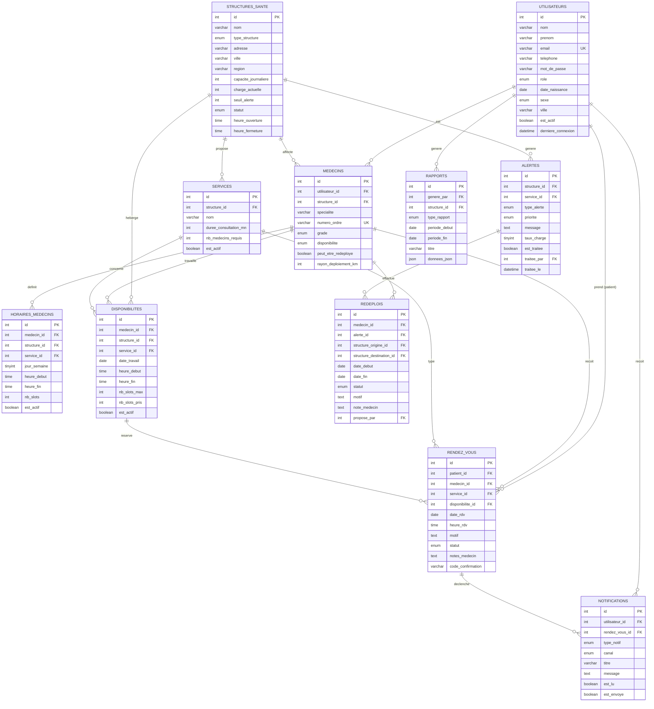

# Modèle Entité-Relation — Sunu Kiray

Coller dans https://mermaid.live/ pour visualiser.

```mermaid
erDiagram
    UTILISATEURS {
        int id PK
        varchar nom
        varchar prenom
        varchar email UK
        varchar telephone
        varchar mot_de_passe
        enum role
        date date_naissance
        enum sexe
        varchar ville
        boolean est_actif
        datetime derniere_connexion
    }

    STRUCTURES_SANTE {
        int id PK
        varchar nom
        enum type_structure
        varchar adresse
        varchar ville
        varchar region
        int capacite_journaliere
        int charge_actuelle
        int seuil_alerte
        enum statut
        time heure_ouverture
        time heure_fermeture
    }

    MEDECINS {
        int id PK
        int utilisateur_id FK
        int structure_id FK
        varchar specialite
        varchar numero_ordre UK
        enum grade
        enum disponibilite
        boolean peut_etre_redeploye
        int rayon_deploiement_km
    }

    SERVICES {
        int id PK
        int structure_id FK
        varchar nom
        int duree_consultation_mn
        int nb_medecins_requis
        boolean est_actif
    }

    HORAIRES_MEDECINS {
        int id PK
        int medecin_id FK
        int structure_id FK
        int service_id FK
        tinyint jour_semaine
        time heure_debut
        time heure_fin
        int nb_slots
        boolean est_actif
    }

    DISPONIBILITES {
        int id PK
        int medecin_id FK
        int structure_id FK
        int service_id FK
        date date_travail
        time heure_debut
        time heure_fin
        int nb_slots_max
        int nb_slots_pris
        boolean est_actif
    }

    RENDEZ_VOUS {
        int id PK
        int patient_id FK
        int medecin_id FK
        int service_id FK
        int disponibilite_id FK
        date date_rdv
        time heure_rdv
        text motif
        enum statut
        text notes_medecin
        varchar code_confirmation
    }

    ALERTES {
        int id PK
        int structure_id FK
        int service_id FK
        enum type_alerte
        enum priorite
        text message
        tinyint taux_charge
        boolean est_traitee
        int traitee_par FK
        datetime traitee_le
    }

    REDEPLOIS {
        int id PK
        int medecin_id FK
        int alerte_id FK
        int structure_origine_id FK
        int structure_destination_id FK
        date date_debut
        date date_fin
        enum statut
        text motif
        text note_medecin
        int propose_par FK
    }

    NOTIFICATIONS {
        int id PK
        int utilisateur_id FK
        int rendez_vous_id FK
        enum type_notif
        enum canal
        varchar titre
        text message
        boolean est_lu
        boolean est_envoye
    }

    RAPPORTS {
        int id PK
        int genere_par FK
        int structure_id FK
        enum type_rapport
        date periode_debut
        date periode_fin
        varchar titre
        json donnees_json
    }

    UTILISATEURS ||--o{ MEDECINS : "est"
    UTILISATEURS ||--o{ RENDEZ_VOUS : "prend (patient)"
    UTILISATEURS ||--o{ NOTIFICATIONS : "recoit"
    UTILISATEURS ||--o{ RAPPORTS : "genere"
    STRUCTURES_SANTE ||--o{ MEDECINS : "affecte"
    STRUCTURES_SANTE ||--o{ SERVICES : "propose"
    STRUCTURES_SANTE ||--o{ DISPONIBILITES : "heberge"
    STRUCTURES_SANTE ||--o{ ALERTES : "genere"
    MEDECINS ||--o{ DISPONIBILITES : "travaille"
    MEDECINS ||--o{ RENDEZ_VOUS : "recoit"
    MEDECINS ||--o{ HORAIRES_MEDECINS : "definit"
    MEDECINS ||--o{ REDEPLOIS : "effectue"
    SERVICES ||--o{ DISPONIBILITES : "concerne"
    SERVICES ||--o{ RENDEZ_VOUS : "type"
    DISPONIBILITES ||--o{ RENDEZ_VOUS : "reserve"
    ALERTES ||--o{ REDEPLOIS : "origine"
    RENDEZ_VOUS ||--o{ NOTIFICATIONS : "declenche"
```
